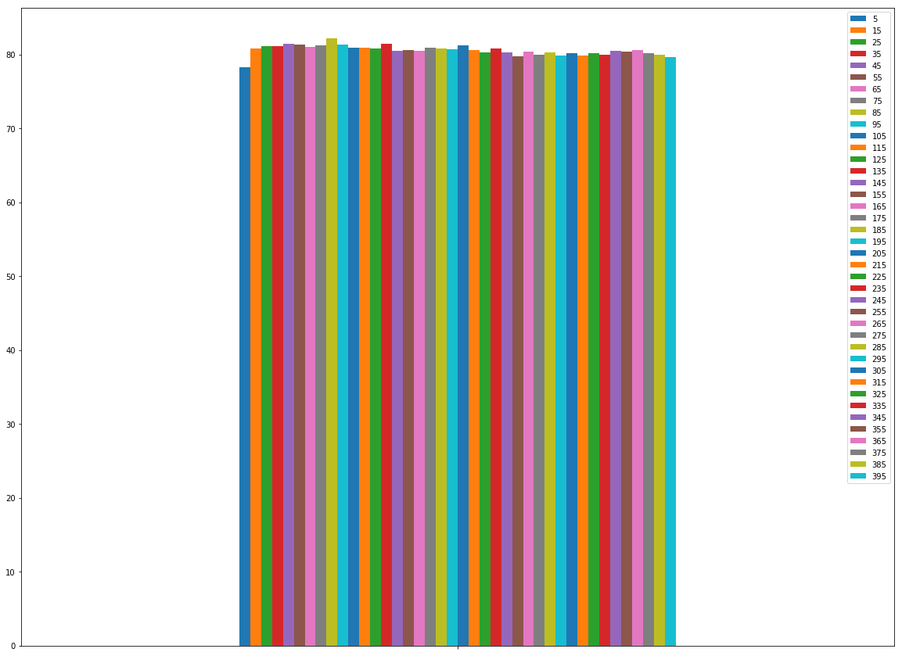
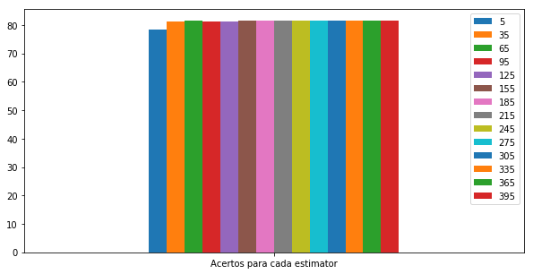

<!----- Conversion time: 6.097 seconds.

Using this Markdown file:

1. Cut and paste this output into your source file.
2. See the notes and action items below regarding this conversion run.
3. Check the rendered output (headings, lists, code blocks, tables) for proper
   formatting and use a linkchecker before you publish this page.

Conversion notes:

* Docs to Markdown version 1.0β17
* Thu Jun 13 2019 20:44:42 GMT-0700 (PDT)
* Source doc: https://docs.google.com/a/cin.ufpe.br/open?id=1uoP_T088QH6oo-uBzi5yEzA7Cp8PpyOQcCk7IOq0IvM
* This is a partial selection. Check to make sure intra-doc links work.
* This document has images: check for >>>>>  gd2md-html alert:  inline image link in generated source and store images to your server.
----->

>>>>>  gd2md-html alert:  ERRORs: 0; WARNINGs: 0; ALERTS: 27.

<ul style="color: red; font-weight: bold"><li>See top comment block for details on ERRORs and WARNINGs. <li>In the converted Markdown or HTML, search for inline alerts that start with >>>>>  gd2md-html alert:  for specific instances that need correction.</ul>

Links to alert messages:
<a href="#gdcalert1">alert1</a>
<a href="#gdcalert2">alert2</a>
<a href="#gdcalert3">alert3</a>
<a href="#gdcalert4">alert4</a>
<a href="#gdcalert5">alert5</a>
<a href="#gdcalert6">alert6</a>
<a href="#gdcalert7">alert7</a>
<a href="#gdcalert8">alert8</a>
<a href="#gdcalert9">alert9</a>
<a href="#gdcalert10">alert10</a>
<a href="#gdcalert11">alert11</a>
<a href="#gdcalert12">alert12</a>
<a href="#gdcalert13">alert13</a>
<a href="#gdcalert14">alert14</a>
<a href="#gdcalert15">alert15</a>
<a href="#gdcalert16">alert16</a>
<a href="#gdcalert17">alert17</a>
<a href="#gdcalert18">alert18</a>
<a href="#gdcalert19">alert19</a>
<a href="#gdcalert20">alert20</a>
<a href="#gdcalert21">alert21</a>
<a href="#gdcalert22">alert22</a>
<a href="#gdcalert23">alert23</a>
<a href="#gdcalert24">alert24</a>
<a href="#gdcalert25">alert25</a>
<a href="#gdcalert26">alert26</a>
<a href="#gdcalert27">alert27</a>

>>>>> PLEASE check and correct alert issues and delete this message and the inline alerts.

**1.0	Descrição do Problema**

O problema tratado aborda inadimplência com cartões de crédito. Nos EUA, por exemplo, cerca de 43% dos usuários, acabam carregando dívidas no cartão de crédito de um mês para o outro. Desses, a maior parte pertence à Geração X (1961-1981) [Fonte: Urban Institute]. Apenas 57% utilizam cartões de crédito para conveniências e ficam fora do vermelho. O impacto é tão grande que essa inadimplência alcançou $1.027 trilhões em março de 2018 [Fonte: Federal Reserve]. 

No Brasil, o quadro não é tão diferente. A Inadimplência das famílias paulistanas atingiu um altíssimo índice de 20,1% em março deste ano e já é a marca mais alta desde outubro do ano passado. Mais de 70% desse saldo negativo é relativo a compras no cartão de crédito. 

**2.0	Conteúdo da Base**

>>>>>  gd2md-html alert: inline image link here (to images/Ci-ncia-de0.png). Store image on your image server and adjust path/filename if necessary.  (<a href="#">Back to top</a>)(<a href="#gdcalert2">Next alert</a>) >>>>> 

A base escolhida,  “Default of Credit Card Clients”, é da UCI  e tem foco nessa inadimplência. Ela contém cerca de 30k instâncias e 25 atributos. Dentre esses, alguns são categóricos, outros são numéricos e há algumas anomalias que precisam ser tratadas. Esses 25 atributos estão divididos da seguinte forma:

>>>>>  gd2md-html alert: inline image link here (to images/Ci-ncia-de1.png). Store image on your image server and adjust path/filename if necessary.  (<a href="#">Back to top</a>)(<a href="#gdcalert3">Next alert</a>) >>>>> 

*   **ID**: Um ID referente a cada cliente que, posteriormente, será ignorado uma vez que é irrelevante para o treino.
*   **LIMIT_BAL**: A quntidade máxima em dólar de crédito concedido incluindo a parcela individual e para a família. 
*   **SEX**: Caso o indivíduo em questão possuir sexo masculino, esse atributo será 1. Caso seja feminino, será 2.
*   **EDUCATION**: Referente ao grau de escolaridade do indivíduo. Caso seja 1, trata-se de alguém com pós-graduação. Sendo 2, alguém que possui graduação. Caso tenha estudado até o colegial, irá constar 3 nesse atributo. Para qualquer outro nível de escolaridade, será 4. Quando 5 e 6, não se sabe a escolaridade do indivíduo.
*   **MARRIAGE**: Referente ao status de relacionamento. Caso 1, trata-se de um indivíduo casado. Sendo 2, solteiro. Para outro tipo de relacionamento, nesse atributo constará o número 3. Caso o status do indivíduo seja desconhecido, estará 0.
*   **AGE**: A idade do indivíduo em anos.
*   **PAY_0**: Pagamento referente a Setembro de 2005. Caso 1, o pagamento foi feito devidamente. Caso entre 2 e 8, indica que o pagamento foi feito com atraso sendo o número referente a quantidade de meses desse atraso. Caso seja 9, significa que o pagamento foi feito com 9 ou mais meses de atraso. Para os demais atributos de PAY_2 a PAY_6, a mesma lógica de valores aplica-se.
*   **PAY_2**: Pagamento referente a Agosto de 2005.
*   **PAY_3**: Pagamento referente a Julho de 2005.
*   **PAY_4**: Pagamento referente a Junho de 2005.
*   **PAY_5**: Pagamento referente a Maio de 2005.
*   **PAY_6**: Pagamento referente a Abril de 2005.
*   **BILL_AMT1**: Valor da fatura em Setembro de 2005, em Dólar
*   **BILL_AMT2**: Valor da fatura em Agosto de 2005, em Dólar
*   **BILL_AMT3**: Valor da fatura em Julho de 2005, em Dólar
*   **BILL_AMT4**: Valor da fatura em Junho de 2005, em Dólar
*   **BILL_AMT5**: Valor da fatura em Maio de 2005, em Dólar
*   **BILL_AMT6**: Valor da fatura em Abril de 2005, em Dólar
*   **PAY_AMT1**: Quantia de pagamento anterior em Setembro de 2005, em dólar
*   **PAY_AMT2**: Quantia de pagamento anterior em Agosto de 2005, em dólar
*   **PAY_AMT3**: Quantia de pagamento anterior em Julho de 2005, em dólar
*   **PAY_AMT4**: Quantia de pagamento anterior em Junho de 2005, em dólar
*   **PAY_AMT5**: Quantia de pagamento anterior em Maio de 2005, em dólar
*   **PAY_AMT6**: Quantia de pagamento anterior em Abril de 2005, em dólar
*   **default.payment.next.month**: Referente a inadimplência do indivíduo no próximo mês. Com 1 representando a inadimplência e 0, a adimplência.

**3.0	Pré-processamento**

	A priori, é notável que não há nenhum valor ausente. Estando, portanto, todos os atributos preenchidos para todos os itens.

>>>>>  gd2md-html alert: inline image link here (to images/Ci-ncia-de2.png). Store image on your image server and adjust path/filename if necessary.  (<a href="#">Back to top</a>)(<a href="#gdcalert4">Next alert</a>) >>>>> 

	No entanto, foi constatado que algumas modificações são necessárias. Alguns atributos possuem valores muito altos e, para esses, será necessário aplicar uma técnica de normalização. Outros atributos possuem números negativos e deverão ter esses valores trabalhados com uma estratégia de binarização, por exemplo. Além disso, há alguns atributos que possuem em torno de 9 categorias e vão precisar sofrer normalização.

**3.1	Atributo Marriage**

Como trata-se de um atributo categórico em que 0 signfica desconhecido, para os que não se sabe o status de relacionamento, serão substituídos por 3, que significa "outros". Para que tenhamos apenas valores binários, serão criadas duas colunas para cada tipo de status Status_married, Status_single, Status_others.

>>>>>  gd2md-html alert: inline image link here (to images/Ci-ncia-de3.png). Store image on your image server and adjust path/filename if necessary.  (<a href="#">Back to top</a>)(<a href="#gdcalert5">Next alert</a>) >>>>> 

**3.2	Atributo Education**

Como trata-se de um atributo categórico em que 5 e 6 significam desconhecido, nos casos em que que não se sabe o grau de escolaridade, serão substituídos por 4 que significa "outros". Será feita uma normalização transformando os atributos categóricos em binários, criando 4 colunas referentes a educação.

**3.3	Tratamento de valores muito grandes**

>>>>>  gd2md-html alert: inline image link here (to images/Ci-ncia-de4.png). Store image on your image server and adjust path/filename if necessary.  (<a href="#">Back to top</a>)(<a href="#gdcalert6">Next alert</a>) >>>>> 

	Para não gerar nenhuma anomalia no resultado, os atributos com valores muito grandes serão normalizados utilizando a técnica MinMaxScaler.

>>>>>  gd2md-html alert: inline image link here (to images/Ci-ncia-de5.jpg). Store image on your image server and adjust path/filename if necessary.  (<a href="#">Back to top</a>)(<a href="#gdcalert7">Next alert</a>) >>>>> 

Sofrem essa normalização os seguintes atributos: LIMIT_BAL, AGE, BILL_AMT1, BILL_AMT2', BILL_AMT3, BILL_AMT4, BILL_AMT5, BILL_AMT6, PAY_AMT1, PAY_AMT2, PAY_AMT3, PAY_AMT4, PAY_AMT5 e PAY_AMT6. Abaixo, é possível perceber que os valores desses atributos ficam entre 0 e 1.

>>>>>  gd2md-html alert: inline image link here (to images/Ci-ncia-de6.png). Store image on your image server and adjust path/filename if necessary.  (<a href="#">Back to top</a>)(<a href="#gdcalert8">Next alert</a>) >>>>> 

**3.4	Atributo SEX**

	Na tentativa de deixar o atributo binário, para todos que são 2, significando "feminino", será posto 0, ficando com 1 para masculino e 0 para feminino.

>>>>>  gd2md-html alert: inline image link here (to images/Ci-ncia-de7.jpg). Store image on your image server and adjust path/filename if necessary.  (<a href="#">Back to top</a>)(<a href="#gdcalert9">Next alert</a>) >>>>> 

**3.5	Conteúdo da base pré-processada**

	Após efetuar todas as etapas de pré-processamento destacadas acima, a base passa a conter 84 atributos, sendo um deles a classe:

*   **ID**: ID of each client
*   **LIMIT_BAL**: Amount of given credit in NT dollars (includes individual and family/supplementary credit
*   **SEX**: Gender (1 = male, 0 = female)
*   **EDU_graduateschool**: EDUCATION is graduate school (1 = yes, 0 = no)
*   **EDU_university**: EDUCATION is university (1 = yes, 0 = no)
*   **EDU_highschool**: EDUCATION is high school (1 = yes, 0 = no)
*   **EDU_others**: EDUCATION is others (1 = yes, 0 = no)
*   **AGE**: Age in years

Repayment status in September, 2005

*   **PAY_0_duly**: Pay duly
*   **PAY_0_D1**: Payment delay for one month (1 = yes, 0 = no)
*   **PAY_0_D2**: Payment delay for two months (1 = yes, 0 = no)
*   **PAY_0_D3**: Payment delay for three months (1 = yes, 0 = no)
*   **PAY_0_D4**: Payment delay for four months (1 = yes, 0 = no)
*   **PAY_0_D5**: Payment delay for five months (1 = yes, 0 = no)
*   **PAY_0_D6**: Payment delay for six months (1 = yes, 0 = no)
*   **PAY_0_D7**: Payment delay for seven months (1 = yes, 0 = no)
*   **PAY_0_D8**: Payment delay for eight months (1 = yes, 0 = no)
*   **PAY_0_D9**: Payment delay for nine months and above) (1 = yes, 0 = no)

Repayment status in August, 2005

*   **PAY_2_duly**: Pay duly (1 = yes, 0 = no)
*   **PAY_2_D1**: Payment delay for one month (1 = yes, 0 = no)
*   **PAY_2_D2**: Payment delay for two months (1 = yes, 0 = no)
*   **PAY_2_D3**: Payment delay for three months (1 = yes, 0 = no)
*   **PAY_2_D4**: Payment delay for four months (1 = yes, 0 = no)
*   **PAY_2_D5**: Payment delay for five months (1 = yes, 0 = no)
*   **PAY_2_D6**: Payment delay for six months (1 = yes, 0 = no)
*   **PAY_2_D7**: Payment delay for seven months (1 = yes, 0 = no)
*   **PAY_2_D8**: Payment delay for eight months (1 = yes, 0 = no)
*   **PAY_2_D9**: Payment delay for nine months and above) (1 = yes, 0 = no)

Repayment status in July, 2005

*   **PAY_3_duly**: Pay duly (1 = yes, 0 = no)
*   **PAY_3_D1**: Payment delay for one month (1 = yes, 0 = no)
*   **PAY_3_D2**: Payment delay for two months (1 = yes, 0 = no)
*   **PAY_3_D3**: Payment delay for three months (1 = yes, 0 = no)
*   **PAY_3_D4**: Payment delay for four months (1 = yes, 0 = no)
*   **PAY_3_D5**: Payment delay for five months (1 = yes, 0 = no)
*   **PAY_3_D6**: Payment delay for six months (1 = yes, 0 = no)
*   **PAY_3_D7**: Payment delay for seven months (1 = yes, 0 = no)
*   **PAY_3_D8**: Payment delay for eight months (1 = yes, 0 = no)
*   **PAY_3_D9**: Payment delay for nine months and above) (1 = yes, 0 = no)

Repayment status in June, 2005

*   **PAY_4_duly**: Pay duly (1 = yes, 0 = no)
*   **PAY_4_D1**: Payment delay for one month (1 = yes, 0 = no)
*   **PAY_4_D2**: Payment delay for two months (1 = yes, 0 = no)
*   **PAY_4_D3**: Payment delay for three months (1 = yes, 0 = no)
*   **PAY_4_D4**: Payment delay for four months (1 = yes, 0 = no)
*   **PAY_4_D5**: Payment delay for five months (1 = yes, 0 = no)
*   **PAY_4_D6**: Payment delay for six months (1 = yes, 0 = no)
*   **PAY_4_D7**: Payment delay for seven months (1 = yes, 0 = no)
*   **PAY_4_D8**: Payment delay for eight months (1 = yes, 0 = no)
*   **PAY_4_D9**: Payment delay for nine months and above) (1 = yes, 0 = no)

Repayment status in May, 2005

*   **PAY_5_duly**: Pay duly (1 = yes, 0 = no)
*   **PAY_5_D1**: Payment delay for one month (1 = yes, 0 = no)
*   **PAY_5_D2**: Payment delay for two months (1 = yes, 0 = no)
*   **PAY_5_D3**: Payment delay for three months (1 = yes, 0 = no)
*   **PAY_5_D4**: Payment delay for four months (1 = yes, 0 = no)
*   **PAY_5_D5**: Payment delay for five months (1 = yes, 0 = no)
*   **PAY_5_D6**: Payment delay for six months (1 = yes, 0 = no)
*   **PAY_5_D7**: Payment delay for seven months (1 = yes, 0 = no)
*   **PAY_5_D8**: Payment delay for eight months (1 = yes, 0 = no)
*   **PAY_5_D9**: Payment delay for nine months and above) (1 = yes, 0 = no)

Repayment status in April, 2005

*   **PAY_6_duly**: Pay duly (1 = yes, 0 = no)
*   **PAY_6_D1**: Payment delay for one month (1 = yes, 0 = no)
*   **PAY_6_D2**: Payment delay for two months (1 = yes, 0 = no)
*   **PAY_6_D3**: Payment delay for three months (1 = yes, 0 = no)
*   **PAY_6_D4**: Payment delay for four months (1 = yes, 0 = no)
*   **PAY_6_D5**: Payment delay for five months (1 = yes, 0 = no)
*   **PAY_6_D6**: Payment delay for six months (1 = yes, 0 = no)
*   **PAY_6_D7**: Payment delay for seven months (1 = yes, 0 = no)
*   **PAY_6_D8**: Payment delay for eight months (1 = yes, 0 = no)
*   **PAY_6_D9**: Payment delay for nine months and above) (1 = yes, 0 = no)
*   **BILL_AMT1**: Amount of bill statement in September, 2005 (Scaled between -1 and 1)
*   **BILL_AMT2**: Amount of bill statement in August, 2005 (Scaled between -1 and 1)
*   **BILL_AMT3**: Amount of bill statement in July, 2005 (Scaled between -1 and 1)
*   **BILL_AMT4**: Amount of bill statement in June, 2005 (Scaled between -1 and 1)
*   **BILL_AMT5**: Amount of bill statement in May, 2005 (Scaled between -1 and 1)
*   **BILL_AMT6**: Amount of bill statement in April, 2005 (Scaled between -1 and 1)
*   **PAY_AMT1**: Amount of previous payment in September, 2005 (Scaled between -1 and 1)
*   **PAY_AMT2**: Amount of previous payment in August, 2005 (Scaled between -1 and 1)
*   **PAY_AMT3**: Amount of previous payment in July, 2005 (Scaled between -1 and 1)
*   **PAY_AMT4**: Amount of previous payment in June, 2005 (Scaled between -1 and 1)
*   **PAY_AMT5**: Amount of previous payment in May, 2005 (Scaled between -1 and 1)
*   **PAY_AMT6**: Amount of previous payment in April, 2005 (Scaled between -1 and 1)

Class

*   **Class**: Default payment next month (1 = yes, 0 = no)

**4.0	Aplicando técnicas de IA**

**	**Foram escolhidas 4 técnicas. A primeira, kNN, separa 30% da base para testes e efetua o treinamento com o restante. Ao final, 21000 foram treinados e  9000 testes foram feitos. Desses, 7293 (81.03%) tiveram resultado correto e 1707 falharam (18.97%).

	A segunda técnica, utiliza o Keras para criar uma rede neural  de duas camadas com k-fold. As duas primeiras, possuem 46 neurônios cada e a função de ativação utilizada foi a relu. A terceira, de saída, possui apenas 1 neurônios e sua função de ativação é sigmoid. Foi feito um k-fold utilizando 7 folds.

>>>>>  gd2md-html alert: inline image link here (to images/Ci-ncia-de8.png). Store image on your image server and adjust path/filename if necessary.  (<a href="#">Back to top</a>)(<a href="#gdcalert10">Next alert</a>) >>>>> 

>>>>>  gd2md-html alert: inline image link here (to images/Ci-ncia-de9.png). Store image on your image server and adjust path/filename if necessary.  (<a href="#">Back to top</a>)(<a href="#gdcalert11">Next alert</a>) >>>>> 

	A terceira técnica escolhida foi K-means. Nela, 30% da base foi teste e o treinamento foi efetuado com o restante. Ao final, 21000 foram treinados e  9000 testes foram feitos. Desses, 7014 (77.93%) tiveram resultado correto e 1986 (22.07%) falharam.

	A quarta técnica escolhida foi a Random Forest utilizando k-fold com 4 folds. Os resultados de cada fold podem ser vistos abaixo:

>>>>>  gd2md-html alert: inline image link here (to images/Ci-ncia-de10.png). Store image on your image server and adjust path/filename if necessary.  (<a href="#">Back to top</a>)(<a href="#gdcalert12">Next alert</a>) >>>>> 

**5.0	Comparando resultados**

**5.1	Impacto do pré-processamento**

Durante o experimento, após aplicar as técnicas de IA antes de depois do pré-processamento, ficou claro o impacto causado por ele para o caso de algumas técnicas e sua irrelevância para o caso de outras. No caso do k-means, por exemplo, o impacto foi enorme, representando uma diferença de aproximadamente 20% no número de acertos. Já com a kNN, o impacto representou menos de 10% e a Random Forest não sofreu com a ausência do pré-processamento. 

K-Means

>>>>>  gd2md-html alert: inline image link here (to images/Ci-ncia-de11.png). Store image on your image server and adjust path/filename if necessary.  (<a href="#">Back to top</a>)(<a href="#gdcalert13">Next alert</a>) >>>>> 

kNN

>>>>>  gd2md-html alert: inline image link here (to images/Ci-ncia-de12.png). Store image on your image server and adjust path/filename if necessary.  (<a href="#">Back to top</a>)(<a href="#gdcalert14">Next alert</a>) >>>>> 

Random Forest

>>>>>  gd2md-html alert: inline image link here (to images/Ci-ncia-de13.png). Store image on your image server and adjust path/filename if necessary.  (<a href="#">Back to top</a>)(<a href="#gdcalert15">Next alert</a>) >>>>> 

Geral

>>>>>  gd2md-html alert: inline image link here (to images/Ci-ncia-de14.png). Store image on your image server and adjust path/filename if necessary.  (<a href="#">Back to top</a>)(<a href="#gdcalert16">Next alert</a>) >>>>> 

**5.2	Rede Neural - Keras**

**	**Abaixo é possível ver o quanto a sensibilidade permanece estável em cada um dos folds enquanto que a especificidade varia um pouco.

>>>>>  gd2md-html alert: inline image link here (to images/Ci-ncia-de15.png). Store image on your image server and adjust path/filename if necessary.  (<a href="#">Back to top</a>)(<a href="#gdcalert17">Next alert</a>) >>>>> 

>>>>>  gd2md-html alert: inline image link here (to images/Ci-ncia-de16.png). Store image on your image server and adjust path/filename if necessary.  (<a href="#">Back to top</a>)(<a href="#gdcalert18">Next alert</a>) >>>>> 

>>>>>  gd2md-html alert: inline image link here (to images/Ci-ncia-de17.png). Store image on your image server and adjust path/filename if necessary.  (<a href="#">Back to top</a>)(<a href="#gdcalert19">Next alert</a>) >>>>> 

>>>>>  gd2md-html alert: inline image link here (to images/Ci-ncia-de18.png). Store image on your image server and adjust path/filename if necessary.  (<a href="#">Back to top</a>)(<a href="#gdcalert20">Next alert</a>) >>>>> 

>>>>>  gd2md-html alert: inline image link here (to images/Ci-ncia-de19.png). Store image on your image server and adjust path/filename if necessary.  (<a href="#">Back to top</a>)(<a href="#gdcalert21">Next alert</a>) >>>>> 

>>>>>  gd2md-html alert: inline image link here (to images/Ci-ncia-de20.png). Store image on your image server and adjust path/filename if necessary.  (<a href="#">Back to top</a>)(<a href="#gdcalert22">Next alert</a>) >>>>> 

**5.3	kNN**

**Neighbors de 5 a 400 variando de 30 em 30 com pesos uniformes**

**Acertos**

**Erros**

**Neighbors de 5 a 400 variando de 30 em 30 com pesos baseados na distância**

**Acertos**

**Erros**

**5.4	Random Forest**

**Estimators variando de 5 a 400 de 30 em 30**

**Máximo de folhas variando de 5 a 400 de 30 em 30**

**5.4	K-Means**

**Variando as métricas de medida de distância**

<!-- Docs to Markdown version 1.0β17 -->
